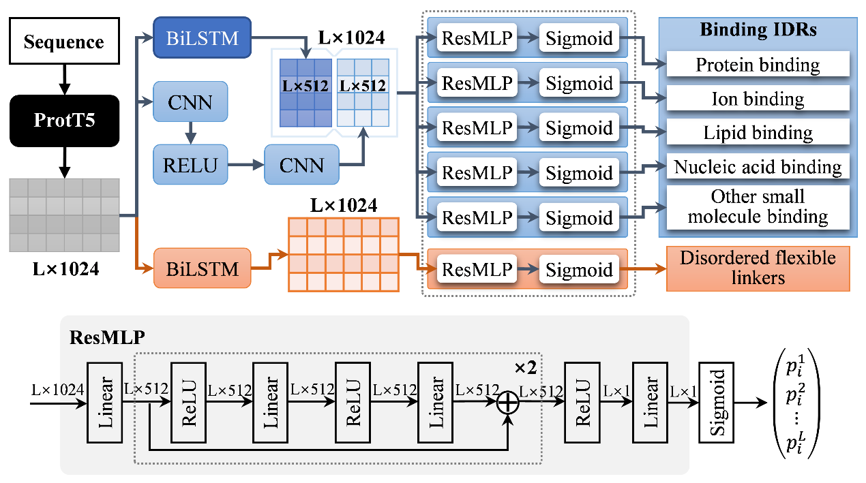

# IDPFunNet

## Overview
IDPFunNet(A novel deep learning framework for systematic prediction of intrinsically disordered protein functions using protein language model) is a software designed for the accurate prediction of various disordered binding functions and disordered flexible linker functions of proteins. Due to the different characteristics of disordered binding functions and flexible linker functions, these two categories are predicted separately. Using sequence semantic vectors obtained from the protein language model ProtT5, a multi-task learning framework and multi-scale information fusion network are employed to predict disordered functional annotations for protein binding, nucleic acid binding, lipid binding, ion binding, and small molecule binding. A global information network is used to predict the disordered functional annotations of flexible linker.

<div align=center></div>

For more details on IDPFunNet, please refer to the manuscript.

## Installation

**Step 1: Install Anaconda**

The anaconda can be downloaded from https://www.anaconda.com/

**Step 2: Clone this repository**

Now, you need to clone this Github repository with
```
git clone https://github.com/IDRIDP/IDPFunNet.git
```

**Step 3: Download the ProtT5 network weights**

Download the ProtT5 model weights from the following link and copy the file to the "/IDPFunNet/utils/prot_t5_xl_uniref50/" directory.
```
https://huggingface.co/Rostlab/prot_t5_xl_uniref50/resolve/main/pytorch_model.bin
```

**Step 4: Navigate to the installation path**
```
cd IDPFunNet
```
**Step 5: Create a new environment**
```
conda env create -f IDPFunNet.yml
conda activate IDPFunNet
```
<br>
</details>   
    
## Run the IDPFunNet

**1 Predict disordered multiple binding functions**
```
python predict.py -t binding -i example.fasta -d gpu0
```
The files `binding_scores.txt` and `binding_binary.txt` are saved in the directory `"/IDPFunNet/data_save/example/result/"`. `binding_scores.txt` contains the predicted scores, and `binding_binary.txt` contains the binary classification results for disordered binding functions of each sequence.
```
File Contents:
              Line 1: >Sequence ID
              Line 2: Protein sequence (1-letter amino acid encoding)
              Line 3: Predicted results for disordered protein-binding functions
              Line 4: Predicted results for disordered nucleic acid-binding functions
              Line 5: Predicted results for disordered lipid-binding functions
              Line 6: Predicted results for disordered ion-binding functions
              Line 7: Predicted results for disordered small molecule-binding functions
```
**2 Predict disordered flexible linker functions**
```
python predict.py -t linker -i example.fasta -d gpu0
```
The files `linker_scores.txt` and `linker_binary.txt` are saved in the directory `"/IDPFunNet/data_save/example/result/"`. `linker_scores.txt` contains the predicted scores, and `linker_binary.txt` contains the binary             classification results for disordered flexible linker functions of each sequence.
```
File Contents:
              Line 1: >Sequence ID
              Line 2: Protein sequence (1-letter amino acid encoding)
              Line 3: Predicted results for disordered flexible linker functions
```
**3 Predict disordered multiple binding and flexible linker functions**
```
python predict.py -t all -i example.fasta -d gpu0
```
The files `all_scores.txt` and `all_binary.txt` are saved in the directory `"/IDPFunNet/data_save/example/result/"`. `all_scores.txt` contains the predicted scores, and `all_binary.txt` contains the binary                         classification results for disordered functions of each sequence.
```
File Contents:
              Line 1: >Sequence ID
              Line 2: Protein sequence (1-letter amino acid encoding)
              Line 3: Predicted results for disordered protein-binding functions
              Line 4: Predicted results for disordered nucleic acid-binding functions
              Line 5: Predicted results for disordered lipid-binding functions
              Line 6: Predicted results for disordered ion-binding functions
              Line 7: Predicted results for disordered small molecule-binding functions
              Line 8: Predicted results for disordered flexible linker functions
```

**4 Explanation of some parameters**

(1) -t specifies the prediction type, with three options: binding, linker, and all, representing disordered multiple binding functions, disordered flexible linker functions, or both, respectively.

(2) -i specifies the input FASTA file.

(3) -d specifies the processor to use, allowing you to choose between gpu or cpu. If you select gpu, you need to append a number to indicate the GPU card index(e.g., gpu0).


## Citation
<span id="citation"></span>
Liang et al, A Hybrid Deep Learning Framework Integrating Protein Language Models and Dual-Pathway Architecture for Predicting Intrinsically Disordered Protein Functions, submitted, 2025.
